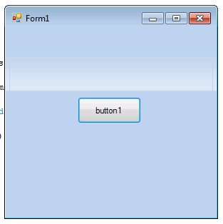

Usage: Create windows.forms application and take stuff from here:

```c#
using System;  
using System.Collections.Generic;  
using System.ComponentModel;  
using System.Data;  
using System.Drawing;  
using System.Linq;  
using System.Text;  
using System.Windows.Forms;  
using System.Runtime.InteropServices;  
  
namespace GlassingJustFallbackInForms  
{  
  public partial class FormGlassedFallback : Form  
  {  
      public FormGlassedFallback()  
      {  
          InitializeComponent();  
      }  
  
      #region WINAPI Crap:  
      private bool isActivated;  
  
      protected override void OnActivated(EventArgs e)  
      {  
          isActivated = true;  
          base.OnActivated(e);  
          this.Refresh(); // Causes flickering, any ideas?  
      }  
  
      protected override void OnDeactivate(EventArgs e)  
      {  
          isActivated = false;  
          base.OnDeactivate(e);  
          this.Refresh(); // Causes flickering, any ideas?  
      }  
  
      protected override void OnPaint(PaintEventArgs e)  
      {  
          IntPtr thmdata = OpenThemeData(this.Handle, "WINDOW");  
          IntPtr hdc = e.Graphics.GetHdc();  
  
          // Not very efficient, but doesn't flicker:  
          RECT rect = new RECT(-2, 0, this.Width, this.Height);  
          // RECT rect = new RECT(e.ClipRectangle.Left-3, e.ClipRectangle.Top, e.ClipRectangle.Right+3, e.ClipRectangle.Bottom);  
  
          base.OnPaint(e);  
          DrawThemeBackground(thmdata, hdc, WP_FRAMELEFT, isActivated ? FS_ACTIVE : FS_INACTIVE, ref rect, 0);  
      }  
  
      private const int FS_ACTIVE = 1;  
      private const int FS_INACTIVE = 2;  
      private const int WP_FRAMELEFT = 7;  
  
      [DllImport("uxtheme", ExactSpelling = true)]  
      private extern static Int32 DrawThemeBackground(IntPtr hTheme, IntPtr hdc, int iPartId,  
         int iStateId, ref RECT pRect, int test);  
  
      [DllImport("uxtheme", ExactSpelling = true)]  
      private extern static Int32 DrawThemeBackground(IntPtr hTheme, IntPtr hdc, int iPartId,  
         int iStateId, ref RECT pRect, IntPtr pClipRect);  
  
      [DllImport("uxtheme.dll", ExactSpelling = true, CharSet = CharSet.Unicode)]  
      private static extern IntPtr OpenThemeData(IntPtr hWnd, String classList);  
  
      private const int WM_PAINT = 15;  
  
      [Serializable, StructLayout(LayoutKind.Sequential)]  
      private struct RECT  
      {  
          public int Left;  
          public int Top;  
          public int Right;  
          public int Bottom;  
  
          public RECT(int left_, int top_, int right_, int bottom_)  
          {  
              Left = left_;  
              Top = top_;  
              Right = right_;  
              Bottom = bottom_;  
          }  
      }  
      #endregion  
  
  
  }  
  
  
}  

```