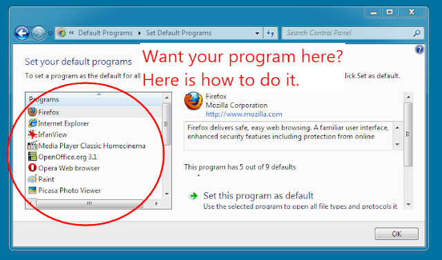

I wanted to have chromium in "Default Programs", so I can associate HTTP protocol to it, here is how I did that. If you want to do same just change `C:\\Program Copies\\Chromium\\chrome.exe` to point your chrome.exe, note that _is in two places!_  
  
For your own program just change the chromium/path etc. to something suitable for your project.  



**ChromiumToSetDefaults.reg**:  
```
Windows Registry Editor Version 5.00  
  
; Infamous capabilities:  
  
[HKEY_LOCAL_MACHINE\SOFTWARE\Chromium\Capabilities]  
"ApplicationDescription"="Chromium - Beta Google Chrome"  
"ApplicationIcon"="C:\\Program Copies\\Chromium\\chrome.exe,0"  
"ApplicationName"="Chromium"  
  
[HKEY_LOCAL_MACHINE\SOFTWARE\Chromium\Capabilities\FileAssociations]  
".htm"="ChromiumURL"  
".html"="ChromiumURL"  
".shtml"="ChromiumURL"  
".xht"="ChromiumURL"  
".xhtml"="ChromiumURL"  
  
[HKEY_LOCAL_MACHINE\SOFTWARE\Chromium\Capabilities\URLAssociations]  
"ftp"="ChromiumURL"  
"http"="ChromiumURL"  
"https"="ChromiumURL"  
  
; Register to Default Programs  
  
[HKEY_LOCAL_MACHINE\SOFTWARE\RegisteredApplications]  
"Chromium"="Software\\Chromium\\Capabilities"  
  
; ChromiumURL HANDLER:  
  
[HKEY_LOCAL_MACHINE\Software\Classes\ChromiumURL]  
@="Chromium Document"  
"FriendlyTypeName"="Chromium Document"  
  
[HKEY_LOCAL_MACHINE\Software\Classes\ChromiumURL\shell]  
  
[HKEY_LOCAL_MACHINE\Software\Classes\ChromiumURL\shell\open]  
  
[HKEY_LOCAL_MACHINE\Software\Classes\ChromiumURL\shell\open\command]  
@="\"C:\\Program Copies\\Chromium\\chrome.exe\" -- \"%1\""
```

