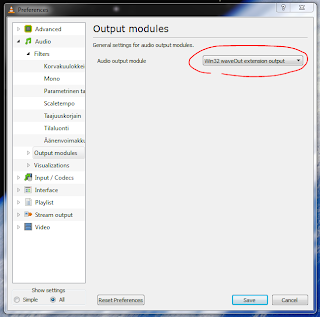

I had this problem with VLC where all output going S/PDIF was stuttering with Windows Vista, and now that I got myself Windows 7 X64, I had to re-fix this problem.  

Now I finally found the fix, so I decided to save it to here for future reference:  

Preferences -> Advanced settings -> Audio -> Output modules -> Win32 waveOut extension output.  

Now the AC3/DTS passthrough works without stuttering.