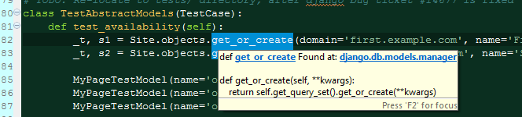

Don't get me wrong, I like Python, PyDev and Django. But I simply hate the _small problems_ like this:  
  

  
I forget something simple, like what was the order of return tuple of `get_or_create`? Then I try to look the tip of the function, and what do I get? The useless `**kwargs` passing.  
  
Same thing with the god damned exception handling. I don't think I've seen any official package that lists the exceptions given function may rise. All functions should have a _good_ doc-strings that lists parameters, exceptions (including nested) and in case the return value is tuple or something non obvious the order of items in tuple.  
  
Simply, it takes ages to open up the webpage, and browse to right place of docs. There exists a fix, but PyDev does not support it. It's the [official objects.inv for Django](http://docs.djangoproject.com/en/dev/_objects/) (sphinx mapping file from keyword to URI).