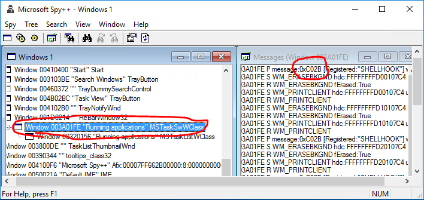
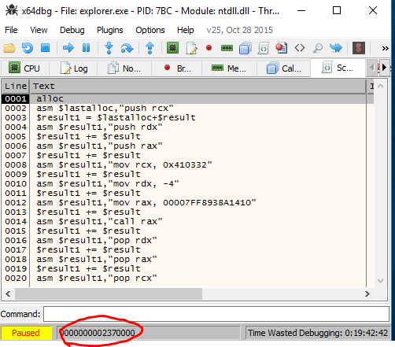
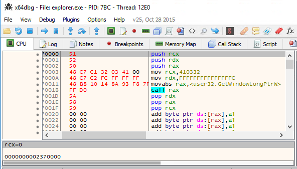
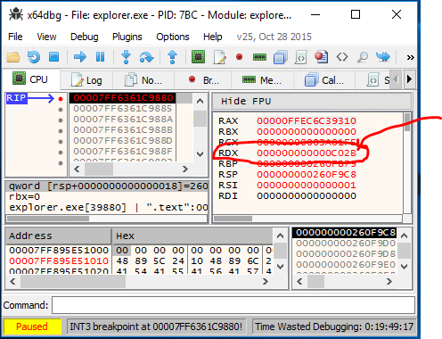
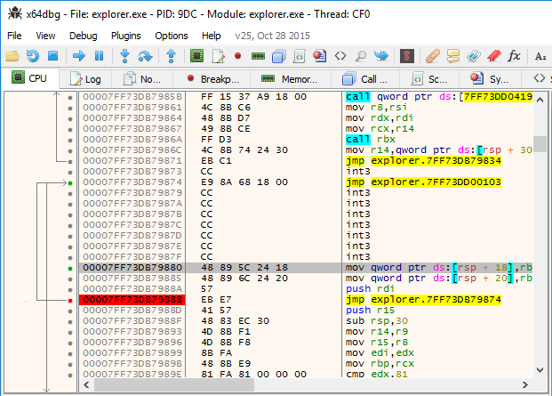
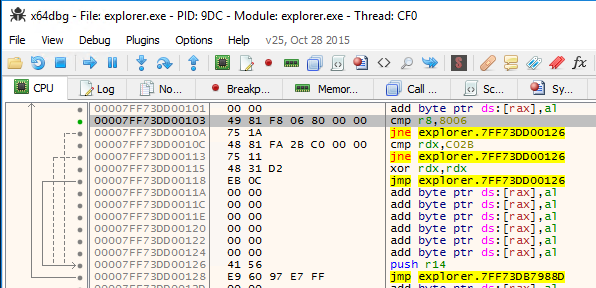

I've waited for a long time so that Microsoft introduces virtual desktops. I used third party programs, mostly VirtuaWin and mdesk (which source code I happened to have.)

Yet when Windows 10 introduced the virtual desktops, they screwed one part that was about to drive me crazy: Flashing task bar buttons shows up in all virtual desktops, and annoys the hell out of you when working on different desktop.

This couldn't go on. I had to find way to prevent this.

1st attempt:

Disassembling user32.dll with simple (dumpbin /all /asm), and patching the FlashWindow(Ex) to do nothing. Would have worked just fine and was easy to do, except that you don't patch user32.dll on this day and age, too many anti-malware tools will scream at you.

2nd attempt:

In-memory patching explorer.exe and preventing the task bar buttons from flashing.

First I had to find out the message which caused the FlashWindowEx message to be run. Hatched up  a small program that flashes the task bar button after a timeout. Then a tool here I used is Spy++ (64bit). Only trick is to go upwards the tree, where SHELLHOOK is first posted:




Above was the simple part for me, I had used Spy++ many times.

Next came a part that I've not had a need to do, debugging a explorer.exe. Tool I found was [x64dbg](http://x64dbg.com/), excellent tool, yet really confusing if you've not done debugging in assembly level ever, or for a short period of time long time ago. Last time I dabbled on assembly level debugging was with SoftICE, and that was discontinued in 2000! (Though I probably tried it somewhere after 2000, it was usable long after)

First I thought I just flash the button and keep stepping the explorer.exe and find miraculously the piece of code. Turns out the explorer.exe has a lot of threads, and x64dbg does not have tracing capability (yet), so that was no go.

I tried hitting C02B in the pattern search, for no avail.

I knew how windows message handling works, so I knew there had to be WndProc somewhere in task switcher, if I could just find the damn thing. After banging my head, I decided to open a question StackExchange Reverse Engineering of [how to find WndProc in x64dbg](http://reverseengineering.stackexchange.com/questions/11210/how-to-find-wndproc-using-x64dbg)? Got a really helpful and comprehensive answer from blabb.

You have to call from within the program you debug a user32.GetWindowLongPtrW(hwnd, GWLP\_WNDPROC) where hwnd I already knew, from Spy++.

Blabb knew how to write a script to do so, the x64dbg has no documentation, it inherits scripting features apparently from other debuggers like ollydbg. I couldn't have written the script commands, assembly I knew though.

Here is the script to call GetWindowLongPtrW by blabb:

```
alloc
asm $lastalloc,"push rcx"
$result1 = $lastalloc+$result
asm $result1,"push rdx"
$result1 += $result
asm $result1,"push rax"
$result1 += $result
asm $result1,"mov rcx, [TYPE THE HWND HERE]"
$result1 += $result
asm $result1,"mov rdx, -4"
$result1 += $result
asm $result1,"mov rax, [TYPE ADDRESS using CTRL+G and type user32.GetWindowLongPtrW]"
$result1 += $result
asm $result1,"call rax"
$result1 += $result
asm $result1,"pop rdx"
$result1 += $result
asm $result1,"pop rax"
$result1 += $result
asm $result1,"pop rcx"
```

(You can of course write to any position in the memory just by double clicking and typing asm, it's a bit faster way sometimes if re-usability is not an issue.)

Now if you run this script, it does nothing. Nothing really happens on your screen, it does not change register etc. It just writes the commands in newly allocated address in memory you find from status bar:



Now you go to this address (Ctrl+G) and you find the code inserted in there:



You move the RIP to there and set breakpoint somewhere after call rax, and before you pop the RAX. The address of WndProc is in the RAX. In my case it was: 00007FF6361C9880. You can verify this also restarting the instance and running it again, it should give same address even if you restart the instance, but not when you restart the computer or virtual machine apparently.

Now that I had my magical address, I could finally (!) see also the message if I triggered the FlashWindowEx and set the breakpoint there:



I just simply zero the RDX register when 0xC02B (SHELLHOOK) and wParam 0x8006 (HSHELL\_FLASH) appears in the registers and BOOM! Flashing task bar buttons does not appear, amazing! First time I managed to get it ignore it.

I knew zeroing the message (RDX) would be relatively safe (as long as I zero it out only on 0xC02B and when wParam is HSHELL\_FLASH) because all WndProcs are just dummy switch cases on messages that falls back on DefaultProc.

Armed with this knowledge I could write a live patch using x64dbg to demonstrate and test the patch before writing a program that patches the explorer.exe.

I replaced one two byte instructinon (push r14) with a short jump and jumped upwards: (Here is two jumps I've added, one in the middle of WndProc (red one), and upper one in with green dot in front)



Then I added my logic for emptying RCX, when C02B and 0x8006 appears in register. This I threw at the bottom of the module since I could not find space from above:



"Push r14" is the instruction I replaced in the WndProc, so I had to run that before returning to it.

And now I had perfectly running explorer.exe, without flashing task bar buttons feature.

Get the final patch as AutoHotkey script from GitHub: [DisableFlashingTaskbarButtons](https://github.com/Ciantic/DisableFlashingTaskbarButtons) I tested it with Windows 10, builds 10565 and 10240. It's written on AutoHotkey and can be used without further dependencies.