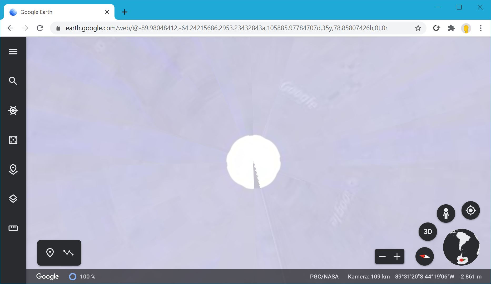
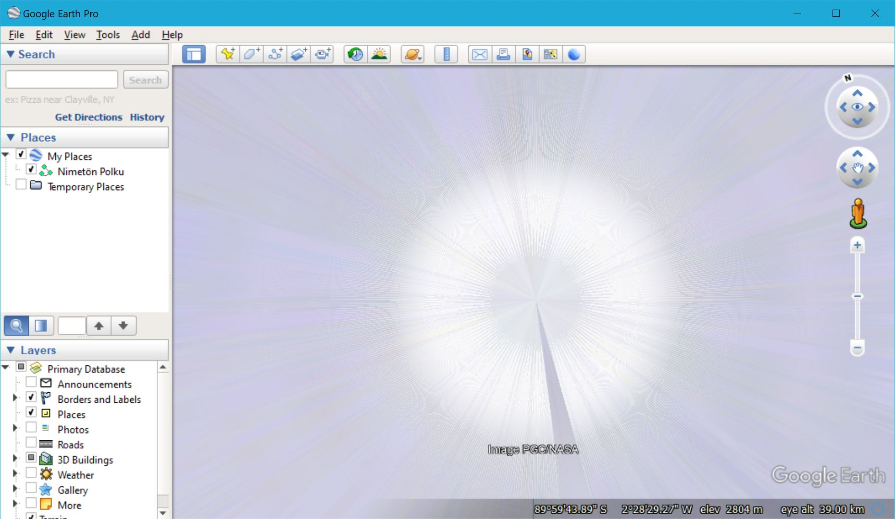

# Good enough

Often times programming is about compromises, wether it's cutting the features or solving a problem with some caveats. After all you can get to minimum viable product faster if you take some shortcuts.

If these good enough solutions don't end up hurting your customer base they might not be fixed. They can start to pile up and accumulate as technical debt. Good engineering practice is to acknowledge this, and act before your pile of hacks become a real problem.

My favorite example is to check the polars in Google Earth once in a while for the texture artefacts. Some day they will fix this, but for now what better way to celebrate Google Earth's 20th year anniversary than looking at the polars!

